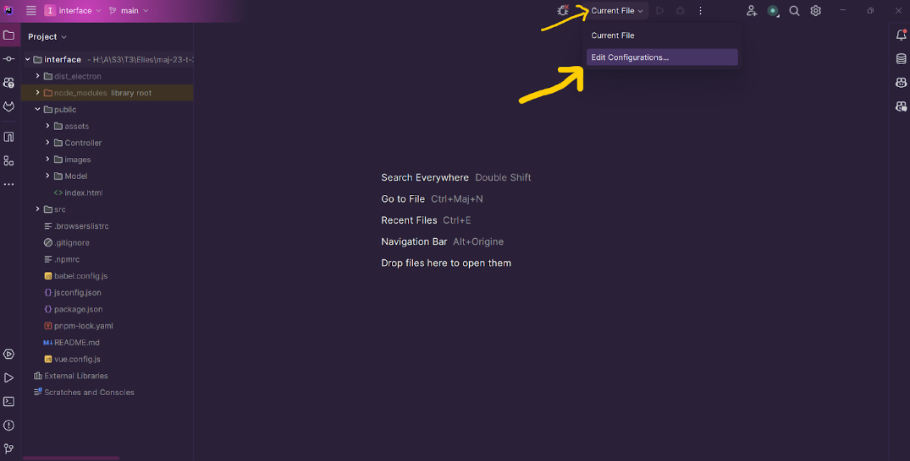
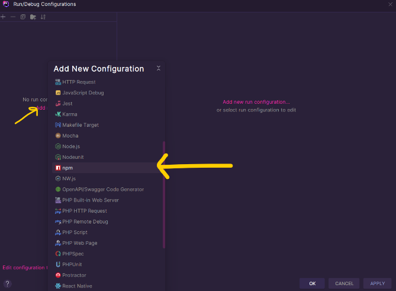
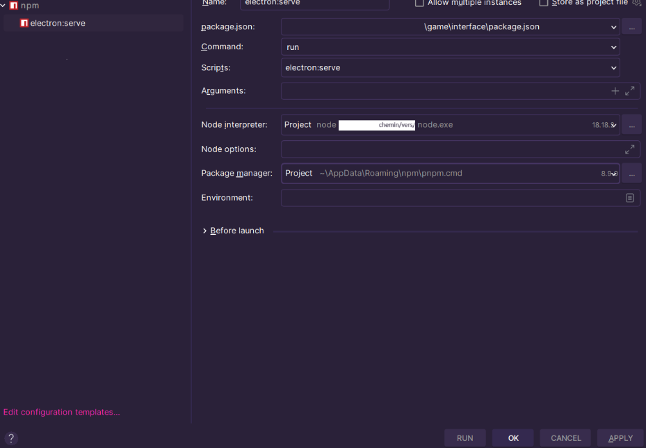
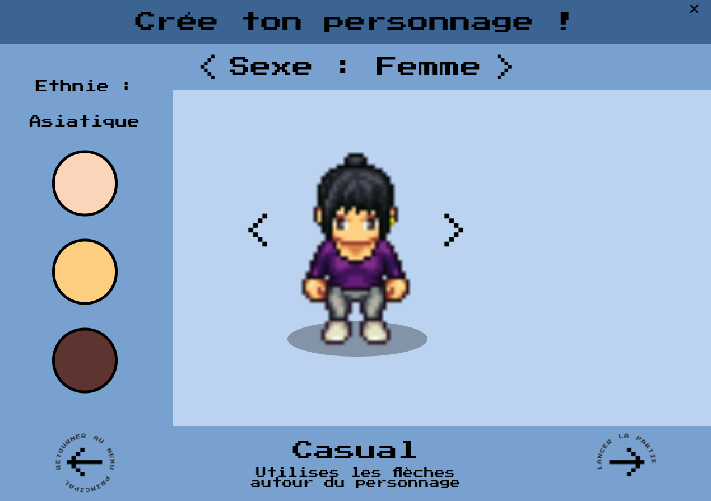
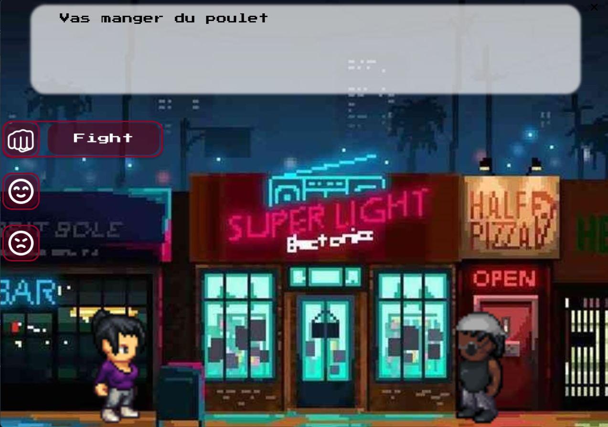
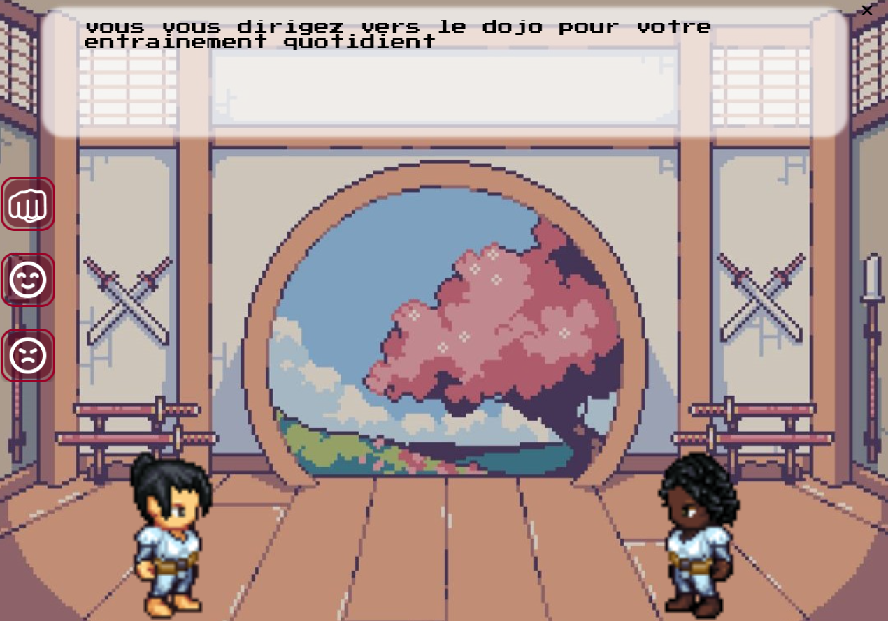
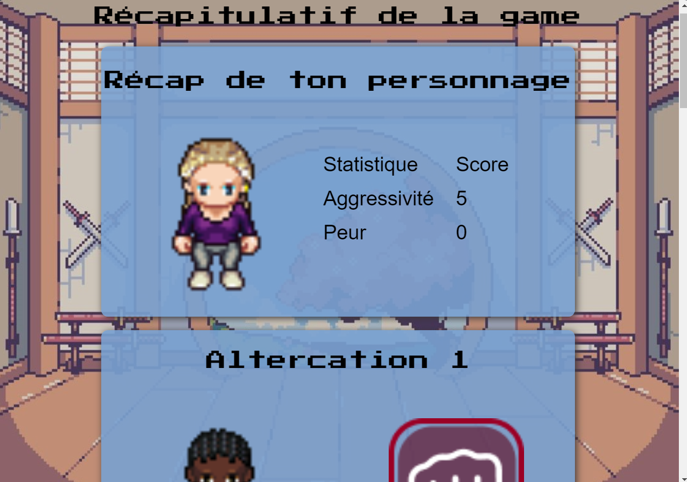

## Présentation du projet

Plongez dans une expérience immersive créée par une équipe d'étudiants passionnés, explorant le spectre complexe de la
violence et sa perception au travers d'un monde interactif captivant.

Dans ce jeu novateur, vous avez la possibilité d'incarner un personnage unique que vous créez, vous plongeant au cœur de
diverses situations chargées de violence. Chaque défi vous confronte à des choix cruciaux, vous obligeant à explorer
différentes manières de réagir, et façonnant ainsi le cours de votre aventure.

Au-delà de l'exploration de la violence sous ses multiples formes, ce jeu explore également la philosophie du jiu-jitsu,
une discipline ancienne qui va bien au-delà des simples mouvements physiques. Cette notion fondamentale vous guide tout
au long de votre parcours, vous enseignant des principes de maîtrise de soi, d'équilibre et de stratégie pour faire face
aux défis avec sagesse et discernement.

Préparez-vous à plonger dans un monde où vos choix définissent votre parcours, où la perception de la violence évolue au
fil de vos actions, et où la pratique du jiu-jitsu devient un guide essentiel pour surmonter les épreuves. Relevez le
défi et explorez les profondeurs fascinantes de ce jeu, où la réflexion et l'action se rencontrent pour vous offrir une
expérience unique et enrichissante.

Voir aussi : [Description.md](./Description.md)

## Procédure d'installation (pour dev)

### Prérequis

[NodeJS](https://nodejs.org/en) : 18.18.2 ou supérieur </br>
[pnpm](https://pnpm.io/installation)</br>
[PHPStorm](https://www.jetbrains.com/fr-fr/phpstorm/) : Ou autre IDE compatible VueJS</br>
[GitBash](https://git-scm.com/downloads) : ou autre moyen de communiquer avec Gitlab

### Commencement

Commencez par forker le projet </br>
Pour mettre en place votre projet git, regardez [le Wiki des commandes](wiki/git_commands.md)
Ouvrez le terminal avec un accès à git ou git Desktop, clonez votre dépôt git avec

```
git clone [votre lien]
```

### Arborescence

Projet
├── Brainstorm</br>
│ └── contient toutes nos 1eres idées</br>
├── Game</br>
│ └── api</br>
│ └── contient l’API utilisée en jeux</br>
├── Interface</br>
│ └── le fichier à ouvrir sur votre IDE</br>
├── public</br>
│ └── contient les images et asset</br>
├── src</br>
│ ├── Contient les Modèles, vue et contrôler</br>
│ ├── routes</br>
│ └── store</br>
│ └── le reste du fichier interface n’est pas à modifier</br>
├── Report</br>
│ └── Les rapports de chaque dev du projet</br>
├── Resource</br>
│ └── les ressources trouvées ou utilisées pour chaque idée</br>
└── Wiki</br>
└── Contient un résumé des commandes git utiles</br>

### Mise en place

Telechargez et installez Node.JS dans le fichier de votre choix.</br>
Telechargez et installez pnpm suivant cotre system d'exploitation.</br>

Deplacez vous dans `game/api`, renommez ``.env.exemple`` en `.env`.
Ouvrez un terminal, et executez : pour installer les dependance et lancer l'api.

```
pnpm install
pnpm run start:win
```

Ouvrez un terminal dans le dossier `game/interface`

```
cd votre/chemin/vers/game/interface
```

Mettez a jour pnpm, pui installez vue@cli et finissez par installer toutes les dependance :

```
pnpm update
npm install -g @vue/cli
pnpm install
```

Ouvrez le dossier interface avec PHPStorm (que l’on va appeler PS). Pour executé la version dev il faut parametrer une
nouvelle configuration pour cela :

Creez une nouvelle configuration,

Sélectionnez une configuration npm


Selectionnez le chemin vers votre package.json</br>
votre chemin vers node.exe que vous avez installer avec Node.JS</br>
et pour package manager le chemin vers pnpm trouvable grace a (sur le terminal)</br>
Sur windows : ```pnpm where```</br>
Sur Linux : ```which pnpm```</br>
Appliquez et validez.</br>

Félicitation, vous pouvez maintenant exécuter le code en tant que dev et le modifié. Pour toutes question, veuillez vous
référer à la doc [Vue.JS](https://vuejs.org/guide/introduction.html)

## Captures d'écran du jeu


Ecran de création du personnage du joueur


Altercation dans la ville entre le joueur et un pnj


Altercation dans le dojo


Page récapitulative de la game

